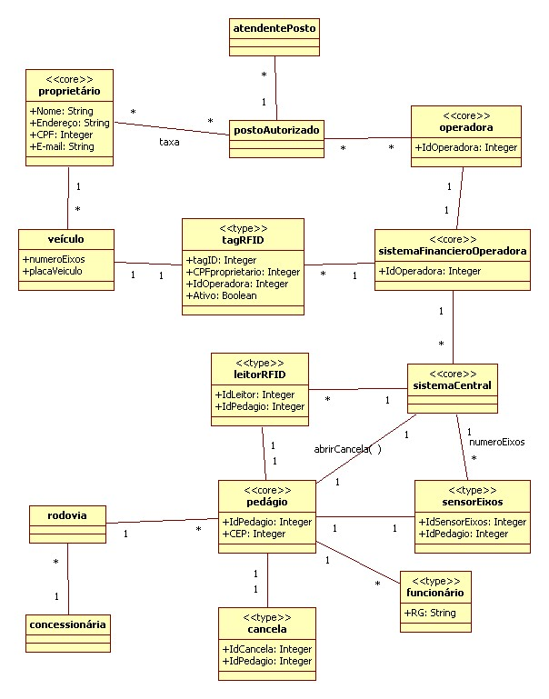

# SAPES (Metrics and Estimate)

OVERVIEW
--------------------------------------------------
The purpose of this project was to estimate Function Points, Line of Code, Quality, Cost, Documentation, Time of Development according to a given hyphthetical system called SAPES and its Entity-Relationship Model for the [Software Engineering] course. It was made at the Computer Science undergraduate program from University of São Paulo (ICMC - USP).

TASK
--------------------------------------------------
```bash
1. Calculate the PF (Function Points) and the corresponding number of LoC (Code Lines) for Java language.
2. Using the hypothetical values below (based on historical data) calculate the Quality, Cost and Documentation for the estimate in question (Pass-Free System).
The. Cost = US $ 23.00 / PF.
B. Documentation = 6 pages / PF.
W. Quality = 0.25 errors / PF.
3. Using the Basic Cocomo model, considering the project class as Organic, calculate the effort and time required for the development of the Pass-Free System.
```

ER-Model
--------------------------------------------------



MORE INFO
--------------------------------------------------
* Please check the files: `project specification.pdf`, `document.pdf` and `ER-Model/T2 - requisitos_sistemaPAsseLivre.pdf` to read about this project.